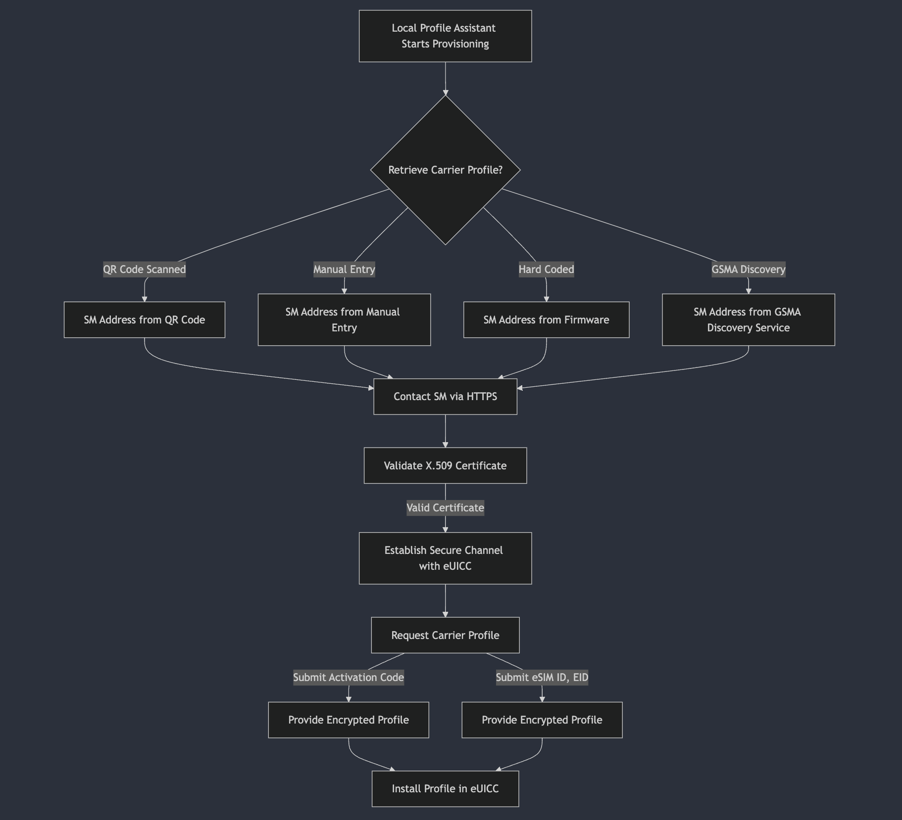

# OpenRSP (Open Source Remote SIM Provisioning)

> ##### *Democratizing Consumer Telco Connectivity*

**Abstract** , Emerging eSIM technology is transforming telecommunications by enabling users to obtain mobile subscriptions over-the-air (OTA) through remote SIM profile provisioning. Unlike traditional SIM cards, eSIMs are embedded directly into devices via an Embedded Universal Integrated Circuit Card (eUICC), eliminating the need for physical stores and reducing the risk of SIM swap attacks. This shift democratizes consumer telecom infrastructure, enhances user experience, and lays the groundwork for a more secure, flexible mobile ecosystem.

At the heart of this ecosystem lies Remote SIM Provisioning (RSP), the software protocol that manages eSIM life-cycle and securely delivers eSIM profiles to secure hardware(user device., embedded UICC chip) through multiple interacting components. When a user selects a subscription plan, the Local Profile Assistant (LPA) on the device sends an intent to the Subscription Manager Data Preparation (SM-DP+) server, which generates and certifies the profile using Public Key Infrastructure (PKI) and X.509 certificates issued by GSMA-compliant entities. The profile is then authenticated and installed on the eUICC, allowing seamless access to cellular services.

Despite its promise, RSP remains immature, with inconsistent security implementations leading to vulnerabilities. The telecom industry continues to face data breaches, and as eSIM adoption accelerates — with half a billion devices shipped in 2023 and projections of 9 billion by 2030 — ensuring interoperability and robust security across devices and carriers becomes increasingly urgent.

We present OpenRSP, a decentralized protocol addressing the current RSP vulnerablities and enhances security, privacy, and interoperability of multiple parties responsible to securely provision eSIMs through cutting-edge cryptographic techniques, smart contracts, decentralized blockchains and Trusted Execution Environment(TEEs). OpenRSP replaces centralized trust points with blockchain and smart contracts, enabling independent verification of transactions. It integrates zero-knowledge proofs (ZKPs) within the X.509 certificate chain to protect sensitive information and introduces Trusted Execution Environments (TEEs) for user plane data integrity with local-first compute. By eliminating single points of failure and empowering entities to collaboratively manage profiles in a trustless environment, OpenRSP addresses the critical challenges of RSP. This approach fortifies telecom infrastructure, safeguards consumer data, and promotes a more resilient, open, and secure mobile ecosystem.

## SeekerSIM Platform Overview

SeekerSIM™ is the production playground for OpenRSP: a blockchain-native eSIM connectivity platform built for the Solana Seeker phone and any eSIM-capable device. The product experience showcased at [seekersim.vercel.app](https://seekersim.vercel.app) demonstrates how global connectivity, crypto payments, and privacy-first identity converge into a single instant activation flow. The public repository is available at [notfartdev/seekersim](https://github.com/notfartdev/seekersim), which contains the Next.js 14 application, Tailwind design system, and animated data/AI visualisations used throughout the marketing site and docs.

### Product Concept

- **Borderless activation:** Users select a destination plan and activate an eSIM within seconds—no physical SIM swaps, no roaming shock.
- **Crypto-native payments:** SOL/USDC pay-as-you-go billing runs on Solana smart contracts, keeping fees below $0.01 with ~1s finality.
- **Privacy by design:** Zero-knowledge proof workflows and decentralized identifiers minimize personally identifiable data while preserving compliance.

### Core Experience & Features

- **ICCID Search / SM-DP+ Integration:** Real-time profile lookup, GSMA SGP.22 compliance, and secure QR provisioning pipelines.
- **Crypto Payments & Global Coverage:** 180+ countries, 650+ carrier networks, automated failover, and smart contract clearing.
- **Privacy First Architecture:** zk-KYC, DID support, and encrypted delivery channels deliver trustless provisioning.
- **SeekerOS™ AI:** Neural activity visualisation, live metrics (active users, network match, activation time, cost savings), and AI panels for network selection, privacy, and usage intelligence.
- **Platform Infrastructure:** Layered architecture covering client apps, Seed Vault integration, Solana mainnet, edge APIs (Vercel), IPFS storage, zk-KYC identity services, and Tier-1/Tier-2 eSIM aggregators.
- **x402 Agent Support:** AI agents and automated systems can pay for API requests in real-time using the [x402 HTTP payment protocol](https://x402.org). Zero protocol fees, instant settlement, no registration required. See [examples/x402-client-example.md](examples/x402-client-example.md) for integration guide.

### Project Resources

- **Live product:** [seekersim.vercel.app](https://seekersim.vercel.app)
- **Source code:** [github.com/notfartdev/seekersim](https://github.com/notfartdev/seekersim)
- **Documentation:** `/docs` route in the deployed app for market thesis, architecture deep dives, and developer onboarding.

## Preliminaries

### eSIM

eSIM exemplifies hardware-software co-design by integrating secure hardware with flexible software to enable seamless, remote mobile connectivity.

### Remote SIM Provisioning

Remote SIM provisioning is a specification realized by GSMA that allows consumers to remotely activate the subscriber identity module (SIM) embedded in a portable device such as a smart phone, smart watch, fitness band or tablet computer. The specification was originally part of the GSMA's work on eSIM and it is important to note that remote SIM provisioning is just one of the aspects that this eSIM specification includes.

### GSMA

The GSM Association (commonly referred to as 'the GSMA' or Global System for Mobile Communications, originally Groupe Spécial Mobile) is a non-profit industry organisation that represents the interests of mobile network operators worldwide. More than 750 mobile operators are full GSMA members and a further 400 companies in the broader mobile ecosystem are associate members.

## Persona and Interactions for RSP

- **Consumer**: Sends intent by selecting a telco/data plan from an array or list of plans provided by MNO (Mobile Network Operator).
- **MNO**: Orders SM-DP+ (Subscription Manager Data Preparation) to create an eSIM profile of the selected telco/data plan and delivers it to respective user device.
- **SM-DP+**: A server-side platform that manages eSIM profiles, prepares eSIM profiles with carrier information and credentials, enables communication between the device and the carrier network via LPA (Local Profile Assistant) and securely stores and delivers eSIM profiles to devices.
- **LPA**: A system application, a software component within eSIM-enabled devices that manages eSIM profiles, interacts with the eUICC (embedded Universal Integrated Circuit Card) chip within the device to store and manage eSIM profile, enabling seamless downloading, installation, and management of mobile network profiles without needing physical SIM cards.
- **eUICC Chip**: Simply put, it's a SIM card component that lets you switch mobile network operators (MNOs) remotely.

### eSIM

The eSIM technology combines the eUICC chip (hardware) and SM-DP+ (software), defines the rules as a protocol for communication between multiple entities, user, MNO, SM-DP+, LPA & eUICC and finally as a system, integrates these elements to achieve secure remote SIM provisioning.

📰 Half a billion eSIM-capable devices were shipped in 2023, Over 9 billion to be shipped by 2030, Nearly 70% proportion cellular devices eSIM capable by 2030.

### Structure

eSIMs adopt a domain-based architecture to separate functionalities and enhance security. This approach divides the SIM's roles into distinct domains, each serving specific purposes.

The concept of "domains" is a structural approach to segregate the functionalities and responsibilities within the SIM.

In eUICC and eSIM (embedded Subscriber Identity Module) technology, domains are used as abstractions to segregate different functionalities, stakeholders, and operational scopes. This abstraction ensures clear separation of concerns and provides flexibility, scalability, and security in managing mobile connectivity. Here are the main domains commonly used:

Unlike traditional SIM cards, eSIMs can be integrated into a System-on-Chip (SoC) or used as upgradable components via APIs like the Android 9 eSIM APIs. GSMA certification mandates that sensitive personalization data—such as Ki, OPc, and 5G keys—be securely processed within the eSIM hardware, eliminating the risk of data extraction. A critical feature of eSIMs is enterprise ownership, granting full control over security configurations, applications, and the selection of operator profiles.

### Domains in eSIM

1. **Subscription Management Domain**
   - **SM-DP (Subscription Manager - Data Preparation)**
     - Typically managed by the MNOs (Mobile Network Providers).
     - Generates and encrypts eSIM profiles.
     - Prepares profiles for provisioning and send encrypted profiles to the SM-SR for delivery to target eUICC.
   - **SM-SR (Subscription Manager - Secure Routing)**
     - Managed by a trusted thrid-party or MNO.
     - Acts as a control plane for SM-DP and eUICC interactions.
     - Responsible for securely routing the encrypted profile from SM-DP to eUICC.

2. **eUICC Domain**
   - The eUICC domain provides a secure, tamper-resistant hardware platform for hosting multiple operator profiles. This domain consists of following sub-domains:
   - **Profile Domain**
     - Represents individual operator profiles stored on eUICC.
     - Contains credentials and settings necessary for network authentication.
     - Multiple profiles can exist on an eUICC but the number of active profiles depends on device capabilities.
   - **Platform Domain**
     - Manages overall eUICC system functionalities.
     - Provides security features and enforces policies for profile management.
     - Facilitates communication between the eUICC, device, and subscription management systems.

3. **Device Domain**
   - The device domain is responsible for interactions between eUICC and the device hosting it. This domain consists of following sub-domains:
   - **Host Device Domain**
     - Represents the hardware device (e.g., smartphone, tablet, IoT device) containing the eUICC.
     - Communicates with the eUICC for operations such as profile activation, deactivation, or switching.
     - Runs the mobile OS or applications interacting with the eUICC.
   - **User Interface Domain**
     - Provides a user-friendly interface for managing eSIM profiles.
     - Accessible via the settings or a dedicated application.
     - Encapsulates functionalities of LPA (Local Profile Assistant).

4. **Connectivity Domains**
   - **Over-The-Air (OTA) Domain**
     - Includes mobile network infrastructure used for profile activation and connectivity.
     - Uses secure protocols (e.g., GSMA’s RSP standard) to communicate between the SM-SR and eUICC.
     - Enables the secure provisioning of new keys, certificates, or updates to the eSIM.
   - **Communication Network Domain**
     - Includes mobile network infrastructure used for profile activation and connectivity.
     - Ensures the eSIM profile works with the corresponding MNO.

5. **Security Domain**
   - **Secure Element (SE) Domain**
     - The hardware-based tamper-resistant element hosting the eUICC.
     - Protects credentials, cryptographic keys, and profiles from unauthorized access.
   - **Cryptographic Domain**
     - Enforces security protocols and encryption for profile delivery, installation, and communication.
     - Uses Public Key Infrastructure (PKI) and other cryptographic methods for authentication and data integrity.

This domain-based architecture adds a layer of abstraction and security, allowing eSIMs to serve its purpose ensuring compliance with security and regulatory requirements.

### X.509 Certificates and Chain of Trust

The Chain of Trust in X.509 certificates is a hierarchical structure used to verify the authenticity of digital certificates.

- It begins with a Root Certificate Authority (Root CA), which is inherently trusted and widely distributed in systems and browsers.
- The Root CA issues and signs certificates for Intermediate Certificate Authorities (Intermediate CAs), which in turn issue certificates to End-Entities (Leaf Certificates), such as websites or users.
- To establish trust, each certificate in the chain must be verified by the certificate above it.

Read more about Chain of Trust [here](https://www.gsma.com/).

OpenRSP replaces blind trust in certificate authorities with verifiable proofs. Each entity—EUM, eUICC, SM-DP+,
SM-DS—generates a zero-knowledge proof that its X.509 certificate satisfies GSMA policies without exposing sensitive
fields. A public on-chain verifier confirms validity, and proofs are registered so participants can reuse them without
disclosing the certificates themselves. This distribution of trust removes the need to rely on centralized data centers
and allows any stakeholder to audit authenticity programmatically.

## RSP Architecture

Major Components:

- Certificate Issuer (CI)
- Operator
- Mobile Service Provider
- SM-DP+ (Data Preparation)
- SM-DS (Discovery Service)
- LPA (Device App)
- eUICC (embedded chip)

### Principles

All parties either implementing or operating systems based on these specifications should be aware that any data items passed between system elements that can be used to identify an individual can be classified as personal data (as defined in the General Data Protection Regulation (EU) 2016/679). Responsibility for the management of Personal Data and compliance with any necessary legislation lies with implementing and operating organisations.

### High Level Authorized Parties

The requirement of GSMA certification is that personalization packet is decoded inside the chip and so there is no way to dump Ki, OPc and 5G keys. Another important aspect is that the eSIM is owned by the enterprise, and this means that the enterprise now has full control of the security and applications in the eSIM, and which operators profiles are to be used.

### Governance Of Secure Elements

‼️ Using embedded Secure Elements inside the smartphone is a matter of business agreements and governance, not a technological issue.

1. **Embedded Secure Element**
   - Owned by smartphone manufacturer
   - eSE management controlled by smartphone manufacturer
2. **Embedded SIM**
   - Owned by smartphone manufacturer
   - Root Certificate of GSMA pre-installed
   - Secure Provisioning done with SM-DP
3. **Embedded SIM with SAM**
   - Owned by smartphone manufacturer
   - Root Certificate Of Member State pre-installed
   - Secure provisioning done with SAM-SM

## Problem

Remote SIM Provisioning (RSP) still operates like a closed club. Every activation hinges on a brittle web of trusted
intermediaries—device manufacturers, mobile network operators, and subscription managers—who exchange keys and X.509
certificates behind the scenes. Users cannot independently verify what happens to their profiles, why an activation
failed, or whether their identifiers were exposed along the way. Manual checkpoints introduce delays and human error,
while the protocol itself leans heavily on TLS tunnels to do most of the security work. The result is a system that is
opaque, difficult to audit, and ill-suited for a world moving toward programmable telecom services.

### eSIM Problem Summary

- **Trust Between Service Providers and Consumers:** Customers must blindly trust intermediaries to provision and manage
  SIM profiles securely. Subscription Managers (SM-DP+) sit between users and carriers, creating concern around how
  sensitive data is handled or shared.
- **Complexity in Profile Management:** Managing multiple profiles across different providers is cumbersome and
  centralized. Operators maintain the keys, and consumers sacrifice transparency and control.
- **Manual Processes and Delays:** Authentication, profile switching, and settlement often require manual approval,
  creating latency and opportunities for mistakes.
- **Unnecessary TLS Encapsulation:** TLS tunnels shoulder critical security guarantees. If the tunnel is compromised,
  the entire provisioning flow is exposed to passive adversaries.
- **Privacy Gaps:** The protocol shares identifiers and metadata freely, enabling tracking and correlation of user
  activity.
- **No User Plane Data Integrity:** Once a profile is live, there are no guarantees that data plane traffic has not been
  tampered with or injected en route.

### RSP Failure Summary

- Trust between service providers and consumers remains centralized and opaque.
- Profile management and switching depend on intermediaries with little transparency.
- Manual processes hamper automation and introduce human error.
- The protocol’s dependence on TLS tunnels is brittle and difficult to harden.
- Privacy protections are minimal; identifiers routinely leak across participants.
- There is no native guarantee of user plane data integrity or authenticity.

## Open Source Remote SIM Provisioning (OpenRSP)

OpenRSP addresses these challenges by decentralizing control, removing reliance on traditional trusted parties, and empowering users with cryptographic ownership of their profiles. By leveraging blockchain, smart contracts, and zero-knowledge proofs, OpenRSP eliminates the need for centralized certificate authorities, allowing entities and consumers to verify transactions independently.

## Approach

Our approach is open source and aims to democratize remote SIM provisioning (RSP) by maintaining sensitive information confidential, enhancing privacy, and strengthening security within the protocol. We address the existing issues and technical challenges in RSP by leveraging smart contracts, blockchain, and modern cryptographic primitives.

### Modern Cryptography

Modern Cryptography helps in securing digital information, interactions between parties, transactions and distributed computations.

#### Zero Knowledge Proving System (ZKPs)

- Can you prove you followed the process without revealing the underlying details?
- Can you prove an outcome is valid without disclosing the steps that led to it?
- Can you verify a claim without revealing anything beyond the claim itself?

These questions underpin the power of modern proving systems. Within OpenRSP they manifest through:

- zkCX (Zero Knowledge Certificate Exchange)
- ZKP for EID privacy (or alternative primitives when lighter anonymity suffices)
- ZK SM-DP+ authentication, potentially via secure multi-party computation with the LPA
- ZK-secured TLS communication, keeping TLS as a privacy layer rather than a single point of failure

### Directions for advancements in privacy of RSP as a protocol

#### Trust Distribution, same certificates
- Proving X.509 certificates with ZKP

The GSMA currently anchors trust by issuing root certificates, while intermediate CAs extend that trust downward. In
OpenRSP, each entity publishes a zero-knowledge proof that its certificate remains within policy, allowing any
participant to verify authenticity without ever seeing the certificate contents. Proofs can be cached on-chain, so
entities reuse them for subsequent sessions without recomputing from scratch.

#### More Privacy, No certificates
- Identity-Based Non-Interactive Key Exchange (IBNIKE)
- Multi-Party Oblivious Transfers (MPOT)

Longer term, OpenRSP explores replacing certificate-heavy flows altogether. Secure identifiers derived from eUICC EIDs
combined with user-held secrets provide strong multi-factor identity without revealing personal data. With MPOT and
garbled circuits, multiple parties collaborate to provision profiles while remaining oblivious to each other&apos;s inputs,
preserving privacy end-to-end.

## Introduction

The rapid adoption of eSIM technology is revolutionizing telecommunications by enabling users to remotely provision and manage mobile subscriptions without physical SIM cards. OpenRSP addresses these challenges by decentralizing control, removing reliance on traditional trusted parties, and empowering users with cryptographic ownership of their profiles.

In the incumbent model, authentication data flows through centralized servers that expose sensitive identifiers and
concentrate risk. As the ecosystem scales toward billions of eSIM-enabled devices, these single points of failure become
untenable. OpenRSP combines blockchain settlement, advanced cryptography, and secure hardware execution to distribute
trust and enforce privacy. Consumers gain verifiable ownership of their profiles, developers plug into programmable
connectivity rails, and operators benefit from transparent, automated settlement.

OpenRSP represents a significant advancement in eSIM provisioning technology, offering a secure and privacy-preserving solution that meets the evolving needs of mobile network operators, device manufacturers, and end users.

---

We will be providing a detailed analysis of the theory, implementation, challenges and potential benefits of incorporating these advanced cryptographic techniques into eSIM technology. Our result will demonstrate that the proposed framework not only significantly improves the security and privacy of the RSP process but also lays the foundation for a more trustworthy and collaborative environment in the digital communication domain.

